# CEM / Ansible Tower Integration worked example

[GitHub Page](https://rhine59.github.io/CEMAnsibleTowerIntegration/)

<!-- TOC -->

- [CEM / Ansible Tower Integration worked example](#cem--ansible-tower-integration-worked-example)
  - [Access details](#access-details)
  - [Ansible Tower Configuration - Walkthru Demo Only](#ansible-tower-configuration---walkthru-demo-only)
    - [View Project](#add-project)
    - [View Ansible Templates](#add-templates)
    - [Run Templates](#run-templates)
  - [CEM Configuration - Step by Step Lab Guide](#cem-configuration---step-by-step-lab-guide)
    - [Ansible Tower Connection](#ansible-tower-connection)
    - [Create RunBooks in Library](#create-runbooks-in-library)
    - [Execute RunBooks in Library](#execute-runbooks-in-library)

<!-- /TOC -->


## Access details

[MCM Login](https://icp-console.apps.169.61.23.248.nip.io/oidc/login.jsp)

[Cloud Event Manager](https://icp-console.apps.169.61.23.248.nip.io/cemui/administration)

[Ansible Tower View Access](https://fs20atsrv.169.62.229.236.nip.io/)
`user1` > `user50` password `alpine-has-acorn-valley`

## Ansible Tower Configuration - Walkthru Demo Only

We will not provide edit access to Ansible Tower here, but rather show you what we have set up to use from CEM.

1. Add Inventory - “Demo Setup” Inventory is already created
2. Add Host - “169.62.229.200” target host is already added in Inventory
3. Add Credential - “root” credential is already created for hosts
4. Add Project - "FastStartLabs2020" is already created
5. Add Ansible Templates - "nginx-container-start" and "nginx-container-stop" are already created
6. Trigger the Templates to test

### Add Project

We have a `project` that is linked to a Git Repository


The `https://github.com/rhine59/CEMAnsibleTowerIntegration.git` Git Repo contains Ansible `playbooks` in the `samples` directory.

```
.
├── README.md
├── nginx_container_start.yaml
├── nginx_container_stop.yaml
├── nginx_install.yaml
└── nginx_uninstall.yaml
```

### Add Templates
Click `Templates` in Ansible menu

We create a new Ansible `Job Template`


Complete the details. Inventory, Project, Playbook and Credentials. 


So we now have two job `templates` in Ansible Tower that we can run under `root`. They each execute a `playbook`


If you look at the playbooks, you will see that they are parameterised with values expected for `nginxname` and `nginxport`.

```
nginx_container_start.yaml

---
- hosts: all
  tasks:
    - name: Run a command to start nginx container
      command: docker run --name={{ nginxname }} -p {{ nginxport }}:80 -d nginx
      become: true

    - name: check {{ nginxname }} container status running on {{ nginxport }}
      command: docker ps -f name={{ nginxname }}
      become: true
      register: finalout
    - debug: var=finalout.stdout_lines

    - debug:
        msg: Access Nginx using http://169.62.229.200:{{ nginxport }}
```

If you look again at the Ansible `template` you see that we have default values for these `playbook` variables at the end of the definition.


Also the right of the template definition we ask to prompt for these values.


### Run Templates
So we are going run these templates.


To the right of the `template`, select the rocket.


We are prompted to override the variable values.


next ...


STDOUT from the running of the job shows success (EXTRACT)

```

PLAY [all] *********************************************************************
TASK [Run a command to start nginx container] **********************************
TASK [check acmenginx container status running on 11013] ***********************
TASK [debug] *******************************************************************
ok: [169.62.229.200] => {
    "finalout.stdout_lines": [
        "CONTAINER ID        IMAGE               COMMAND                  CREATED             STATUS                  PORTS                   NAMES",
        "1cd2eab239db        nginx               \"nginx -g 'daemon of…\"   1 second ago        Up Less than a second   0.0.0.0:11013->80/tcp   acmenginx"
TASK [debug] *******************************************************************
ok: [169.62.229.200] => {
    "msg": "Access Nginx using http://169.62.229.200:11013"
PLAY RECAP *********************************************************************
169.62.229.200             : ok=5    changed=2    unreachable=0    failed=0    skipped=0    rescued=0    ignored=0   
```

a quick look at the target machines shows the running container.

```
root@fs20icamtest:~# docker ps
CONTAINER ID        IMAGE               COMMAND                  CREATED             STATUS              PORTS                   NAMES
1cd2eab239db        nginx               "nginx -g 'daemon of…"   2 minutes ago       Up 2 minutes        0.0.0.0:11013->80/tcp   acmenginx
```


## CEM Configuration - Step by Step Lab Guide

[MCM Login](https://icp-console.apps.169.61.23.248.nip.io/oidc/login.jsp)

So from the MCM console `Monitor Health` > `Incidents` > `Administration`


takes you to


The go to `runbooks`

### Ansible Tower Connection

Check out that under `Connections` we have a valid connection to `Ansible Tower`


### Create Automations

Go to `Automations` and Add `New Automation`

```
Select Type as "Ansible Tower"
Enter name as "userXX-nginx-container-start" - Change XX with User label provided to you in Lab
Select Job Template as "nginx-container-start"
```


Note that we could edit the `extraVariables` to provide some defaults for what comes. No action here as variables will be passed thru RunBook.

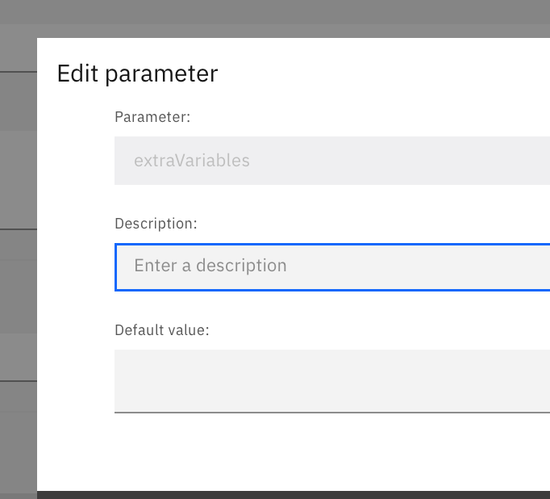

Add another automation to Stop container

```
Select Type as "Ansible Tower"
Enter name as "userXX-nginx-container-stop" - Change XX with User label provided to you in Lab
Select Job Template as "nginx-container-stop"
```

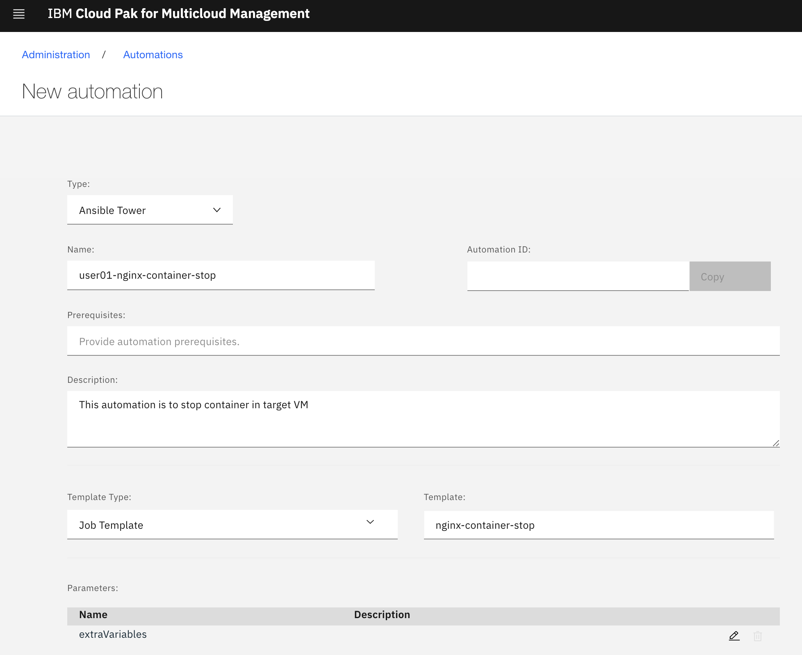

Complete the details for both start and stop activities

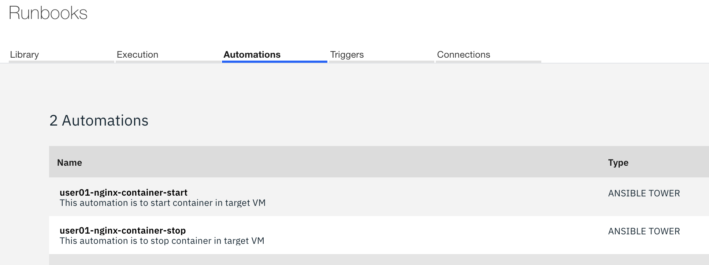


### Create RunBooks in Library

Go to `Library` and Add `New Runbook`

```
Enter name as "userXX-nginx-start" - Change XX with User label provided to you in Lab
Add automation "userXX-nginx-container-start"
```


Popup will appear to enter extraVariables.

```
select "New Runbook Parameter"
Enter Default value as { "nginxport" : "110XX" , "nginxname" : "userXX-nginx" }
Change XX with User label provided to you in Lab
Click Save & Apply on the Popup
Click "Publish"
```

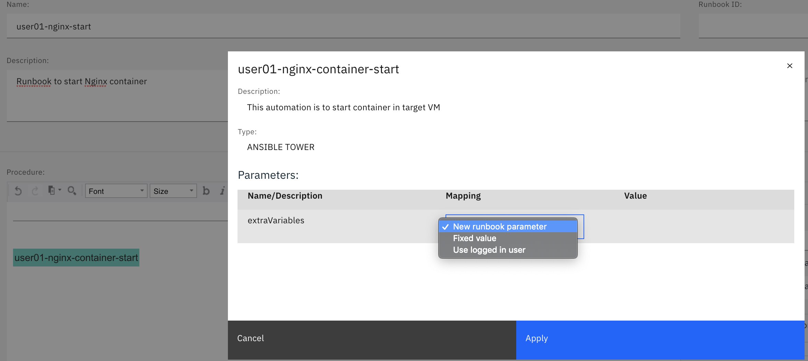

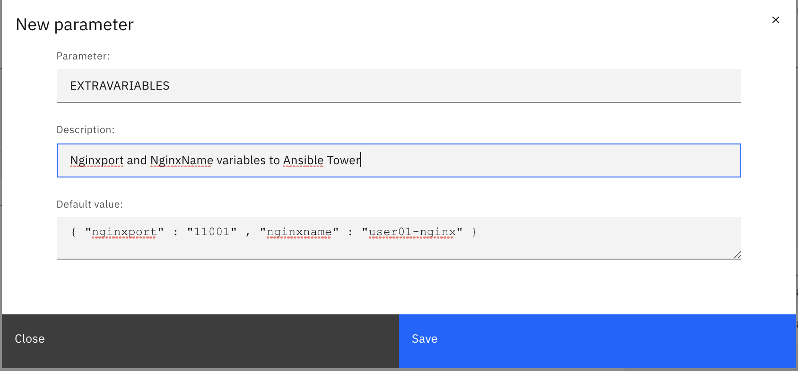

Add another Runbook to stop Nginx

```
Enter name as "userXX-nginx-stop" - Change XX with User label provided to you in Lab
Add automation "userXX-nginx-container-stop"
```

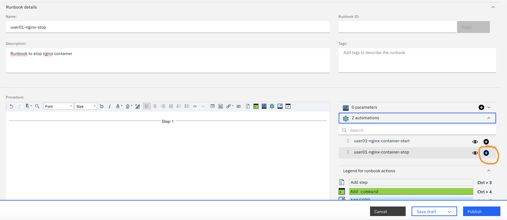

Popup will appear to enter extraVariables.

```
select "New Runbook Parameter"
Enter Default value as { "nginxname" : "userXX-nginx" }
Change XX with User label provided to you in Lab
Click Save & Apply on the Popup
Click "Publish"
```

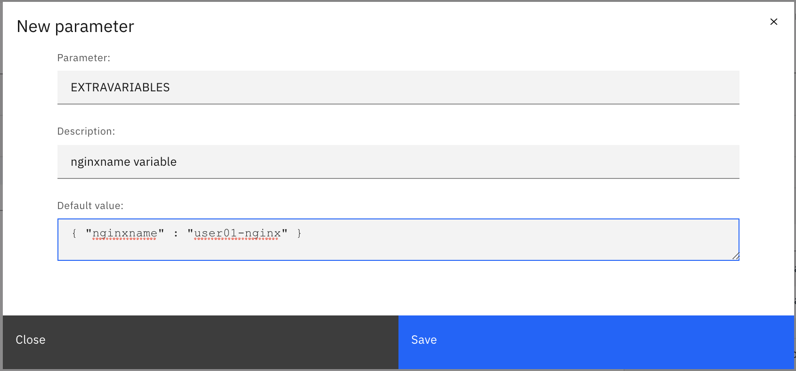

Runbooks will be published and available in Library

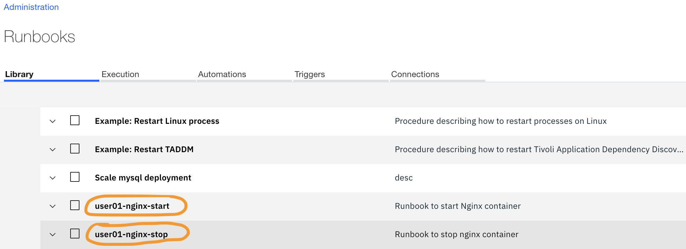


### Execute RunBooks in Library

So let's now execute the `runbook` from CEM.

```
Select "userXX-nginx-start" and Click on Run Icon as shown below
```


```
Make sure nginxname and nginx port variables are populated as per the user labels provided to you in Lab
{ "nginxport" : "110XX" , "nginxname" : "userXX-nginx" }
Click "Apply and Run"
Select "userXX-nginx-container-start" and Click Run
```
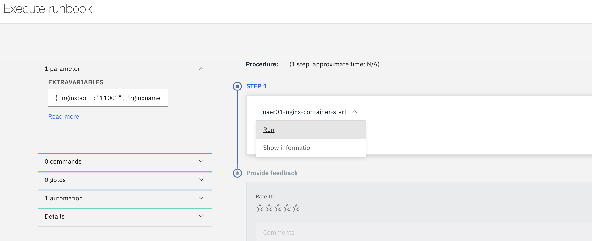

See the Results and Access the Nginx URL http://169.62.229.200:110XX
Click Complete and Rate your Runbook

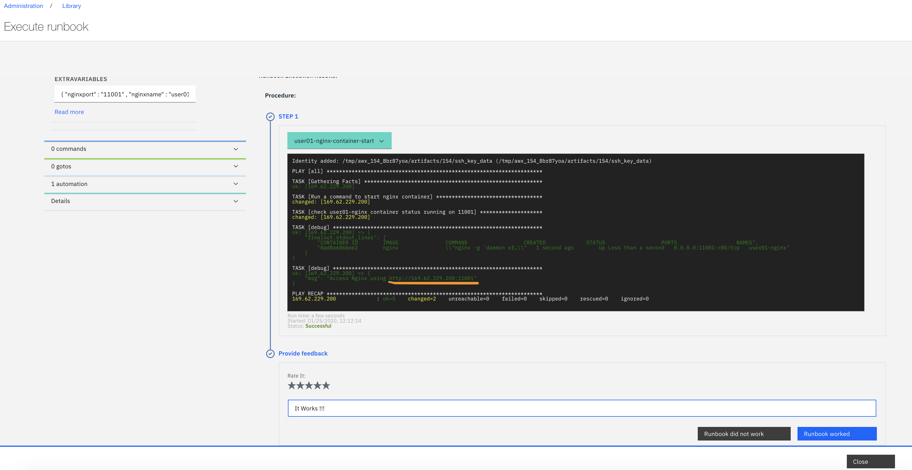

Run the "userXX-nginx-stop" Runbook

```
Make sure nginxname and nginx port variables are populated as per the user labels provided to you in Lab
{ "nginxname" : "userXX-nginx" }
Click "Apply and Run"
Select "userXX-nginx-container-stop" and Click Run
```
Click Complete and Rate your Runbook
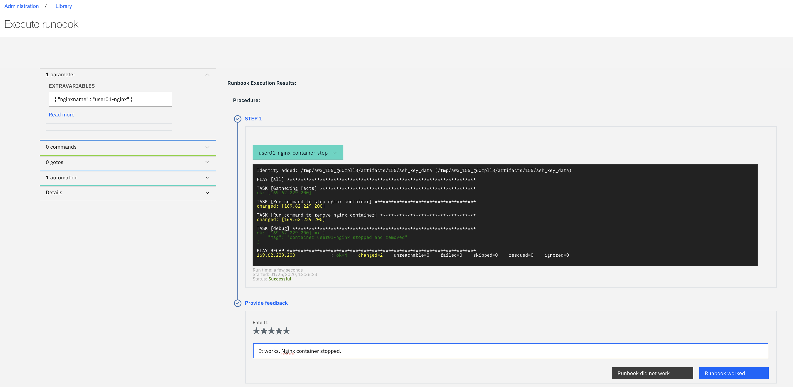

All done :) 
