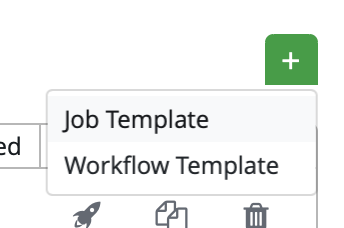
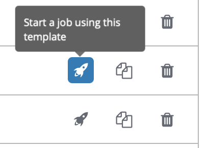

# Walkthrough of Ansible Tower.

We will not provide direct access to Ansible Tower here, but rtaher, we will show you what we have set up to use from CEM

We have a `project` that is linked to a Git Repository


Create a new project


The `https://github.com/rhine59/CEMAnsibleTowerIntegration.git` Git Repo contains Ansible `playbooks` in the `samples` directory.

```
.
├── README.md
├── nginx_container_start.yaml
├── nginx_container_stop.yaml
├── nginx_install.yaml
└── nginx_uninstall.yaml
```
We create a new Ansible `Job Template`



Complete the details


and then save it away.

So we now have two job `templates` in Ansible Tower that we can run under `root`. They each execute a `playbook`


If you look at the playbooks, you will see that they are parameterised with values expected for `nginxname` and `nginxport`.

```
nginx_container_start.yaml

---
- hosts: all
  tasks:
    - name: Run a command to start nginx container
      command: docker run --name={{ nginxname }} -p {{ nginxport }}:80 -d nginx
      become: true

    - name: check {{ nginxname }} container status running on {{ nginxport }}
      command: docker ps -f name={{ nginxname }}
      become: true
      register: finalout
    - debug: var=finalout.stdout_lines

    - debug:
        msg: Access Nginx using http://169.62.229.200:{{ nginxport }}
```

If you look again at the Ansible `template` you see that we have default values for these `playbook` variables at the end of the definition.


Also the right of the template definition we ask to prompt for these values.


So we are going run these templates.


To the right of the `template`, select the rocket.



We are prompted to override the variable values.


next ...


STDOUT from the running of the job shows success (EXTRACT)

```

PLAY [all] *********************************************************************
TASK [Run a command to start nginx container] **********************************
TASK [check acmenginx container status running on 11013] ***********************
TASK [debug] *******************************************************************
ok: [169.62.229.200] => {
    "finalout.stdout_lines": [
        "CONTAINER ID        IMAGE               COMMAND                  CREATED             STATUS                  PORTS                   NAMES",
        "1cd2eab239db        nginx               \"nginx -g 'daemon of…\"   1 second ago        Up Less than a second   0.0.0.0:11013->80/tcp   acmenginx"
TASK [debug] *******************************************************************
ok: [169.62.229.200] => {
    "msg": "Access Nginx using http://169.62.229.200:11013"
PLAY RECAP *********************************************************************
169.62.229.200             : ok=5    changed=2    unreachable=0    failed=0    skipped=0    rescued=0    ignored=0   
```

a quick look at the target machines shows the running container.

```
root@fs20icamtest:~# docker ps
CONTAINER ID        IMAGE               COMMAND                  CREATED             STATUS              PORTS                   NAMES
1cd2eab239db        nginx               "nginx -g 'daemon of…"   2 minutes ago       Up 2 minutes        0.0.0.0:11013->80/tcp   acmenginx
```
